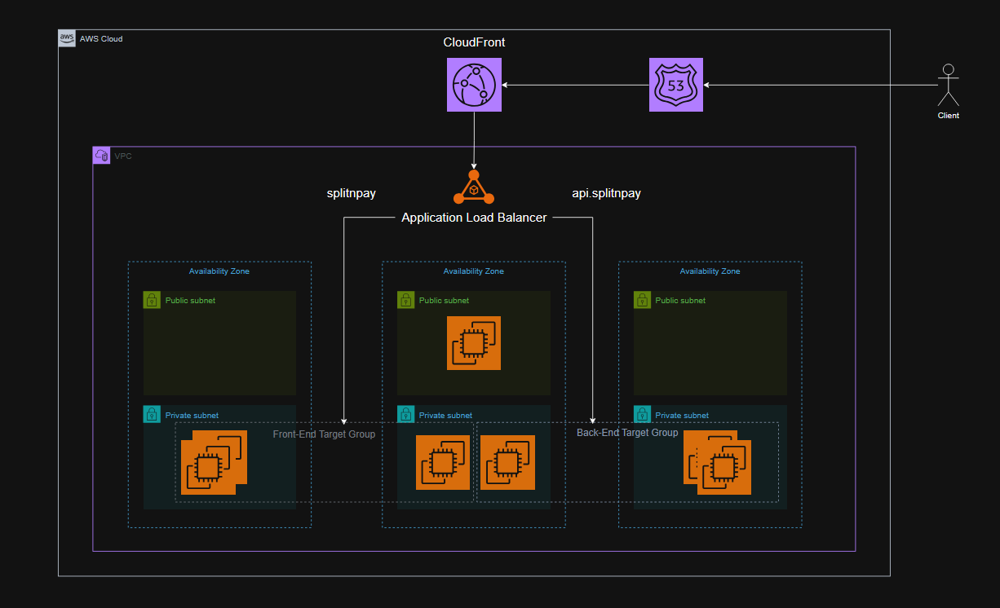

# Source code for TBC's techXplore event
To view other team member's code, visit [GitLab](https://gitlab.com/scanpay1)

[More info about a 4-day Hackathon held by TBC Bank.](https://bm.ge/news/tibisis-inovatsiuri-teqghonisdzieba-techxplore-2025?utm_source=bm&utm_medium=website&utm_campaign=tbc)

---
- High Level Design

# Technology

IaC Tools:
- Terraform
- Ansible

CI/CD:
- GitLab Pipelines

Containerization:
- Docker

Scripting:
- Bash

Monitoring:
- Prometheus
- Grafana
